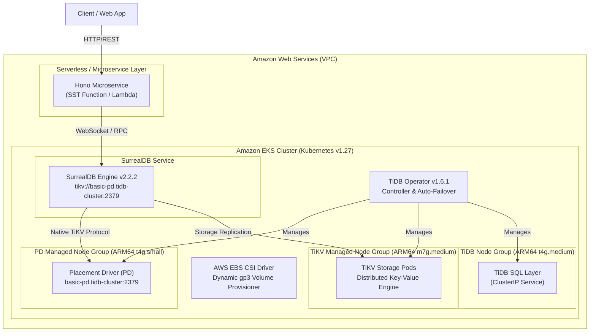

# Infrastructure Architecture

This repository provisions a production-grade distributed **SurrealDB** cluster backed by **TiKV** on **Amazon EKS** using SST and Pulumi.

## System Architecture Diagram

## Key Infrastructure Components

1. **Storage Subsystem (TiKV & PD):**
   - **PD (Placement Driver):** Manages cluster metadata and shard allocation (table regions).
   - **TiKV:** Multi-Raft distributed transactional key-value store providing ACID semantics.
   - **EBS CSI Driver:** Automates dynamic attachment of AWS `gp3` storage volumes per storage node.

2. **Database Engine (SurrealDB):**
   - Configured in distributed storage mode via `tikv://basic-pd.tidb-cluster:2379`.
   - Decoupled compute from storage allows independent scaling of query handlers vs storage shards.

3. **Application API (Hono Service):**
   - Low-latency microservice using Hono and `@surrealdb/node`.
   - Exposes `/health`, `POST /users`, and `GET /users` endpoints.
